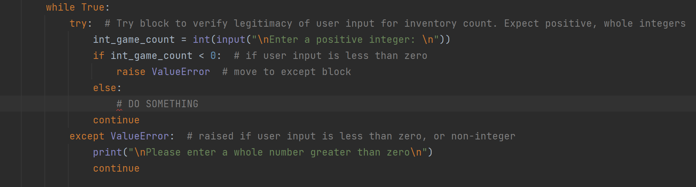

### Bryan Mon
### August 24, 2021
### IT FDN 110 A Su 21: Foundations Of Programming: Python
### Assignment 07
### My Assignment at Github: https://github.com/bmon1216/IntroToProg-Python-Mod06 
### My Github page: https://github.bmontech.com

# Try / Except and Pickle

## Introduction
Our assignment this week was less restrictive compared to our previous assignments. Instead of working with premade code, we were given a task to conduct independent research on Try blocks and Pickle in Python. We were the instructed on applying this research into a script of our own. I put my lessons into practice by making a small program which uses try blocks to assist users in inputting data, as well as, saving that data to a binary file using Pickle.

##Try / Except 
In our previous code, we often displayed a prompt to the user instructing them on the type of input data we are expecting. We leave it up to the user to enter the correct type of data, but sometimes, our instructions are not perfectly followed. Being an end user of many applications myself, I am the first to admit that many times, I skip reading most text on the screen. Now that I am on the other end, it’s my job as a developer to try and prevent the users from breaking my programs.
Python has a built-in tool called a Try block, which helps check code for errors, and can provide information to both the user and developer on how to resolve the issue. In my assignment, I used a Try block while taking in the users input for an inventory count. In Figure 01, you can see that the try block encapsulates a selection of my input capture. 
 
####
### FIGURE 1-TRY BLOCK TO ENFORCE POSITIVE WHOLE INTEGERS INPUT BY USER
The user will input data into the program, we convert it to an Integer, and an if statement will check to see if the integer is greater than zero. If it fails, we raise and error called “ValueError”. From there, the code skips down to the except ValueError line where it prints a message to the user explaining the problem. 
Pickle

The second part of our lesson this week has to do with saving data to files. Our previous assignments taught us how to read, write, and append to text files, which has been a convenient way to save long-term data to files. This week, we learned that we can save the data to other types of files, such as a binary file. Saving data to binary has a few advantages, it masks most of the data from being read by humans, since most of the data is converted away from ASCII. Another benefit of a binary file is that they are typically smaller in size compared to text files, while still containing the same amount of data. In larger files with thousands of lines of data, there can be a noticeable difference in speed when reading / writing to the files. 
In order to store data in binary files in Python, we have to use a built-in library module called Pickle. Pickle is used to serialize and deserialize a Python object into a byte stream, so that data can be stored in a file. 
Using the Pickle module is fairly simple. In figure02, you can see that I need to tell the interpreter that I plan to use Pickle, by importing it. The syntax is similar to writing to a text file, with some minor differences. When Pickling, we need to open the file with “wb”, or write bytes, since we are specifically writing to a binary file. In addition, we use the pickle.dump function, which will serialize the data stream and save our data to the file. 

 
FIGURE 2-PICKLING WITH WRITE BYTES TO SAVE OUR DATA TO A FILE CALLED GAMELIST.DAT

##Conclusion
Error handling not only helps the developer from unexpected crashes, but it can also help the user with understanding on how to use your program. Since the beginning of this Python course, I’ve always written my code to be as user friendly as possible, by printing informative prompts. It’s important to me that my program is not only useful, but also not difficult to use, otherwise I risk users not using the program at all. I expect that our future assignments will be more end-user focused going forward. 
